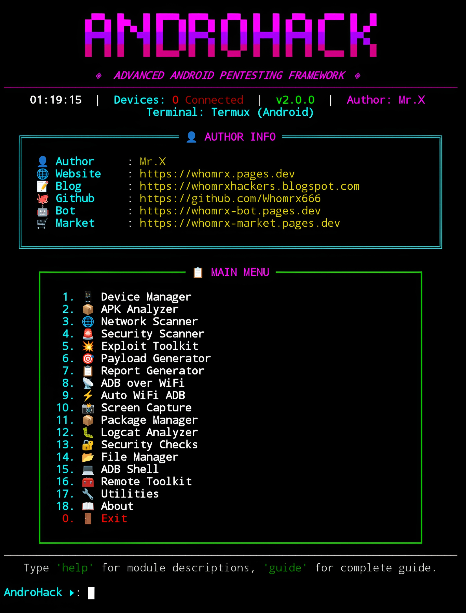

# AndroHack


<p align="center">
  <strong>Advanced Android Pentesting Framework</strong><br>
  <em>"Intelligence and security, fused in neon." – Mr.X</em>
</p>

## Introduction
AndroHack is an all-in-one Android penetration testing framework built for ethical security testing, vulnerability assessment, and post-exploitation research. With **18 integrated modules** covering static APK analysis, dynamic runtime analysis via ADB, network scanning, vulnerability mapping, exploit assistance, payload generation, and professional report generation. The sleek cyberpunk terminal interface runs smoothly on **Termux (Android)**, Linux, Windows, and Kali Linux—**no root required** (some exploits may require root on target device).

## Installation
```bash
$ pkg update -y && pkg upgrade -y
$ pkg install git python -y
$ git clone https://github.com/Whomrx666/Androhack.git
$ cd Androhack
$ python3 install.py
```
## Run manually
```
$ python3 androhack.py
```

## Or run in CLI mode
```
$ python3 androhack.py --interactive
$ python3 androhack.py --devices
$ python3 androhack.py --apk app.apk --report html
```
## CLI Examples
```bash
python3 androhack.py --interactive
python3 androhack.py --apk app.apk --report html
python3 androhack.py --device ABC123 --vuln-scan --pkg com.example.app
python3 androhack.py --device ABC123 --port-scan
python3 androhack.py --payload reverse_tcp --lhost 10.0.0.1 --lport 4444
python3 androhack.py --device ABC123 --exploit deep-link --pkg com.example --scheme myapp
python3 androhack.py --devices
```

> **Note:** Some features require ADB installed and USB Debugging enabled on the target Android device. For advanced payload generation (msfvenom), Metasploit Framework must be installed.

## Features
- **Device Manager** – Manage connected Android devices via ADB.
- **APK Analyzer** – Static analysis and reverse engineering of APK files.
- **Network Scanner** – Multithreaded port scanning, host discovery, and WiFi info gathering.
- **Vulnerability Scanner** – Detect CVEs, root status, insecure data storage, exported components, and more.
- **Exploit Toolkit** – Launch exported activities, trigger broadcasts, deep link fuzzing, Frida injection guides.
- **Payload Generator** – Generate malicious APKs, reverse shells, intent payloads, and obfuscated commands.
- **Report Generator** – Export professional HTML, JSON, and table reports.
- **ADB over WiFi** – Enable and auto-connect ADB wirelessly.
- **Cyberpunk UI** – Neon colors, animations, and clean menu system.
- **Cross-Platform** – Works on Termux (Android), Linux, Windows, macOS, and Kali Linux.

## Modules Overview
| #  | Module | Description |
|----|--------|-------------|
| 01 |  Device Manager | Manage connected Android devices |
| 02 |  APK Analyzer | Analyze & reverse Android APK files |
| 03 |  Network Scanner | Scan hosts, ports & WiFi networks |
| 04 |  Security Scanner | Detect vulnerabilities & security issues |
| 05 |  Exploit Toolkit | Deep links, intents & testing modules |
| 06 |  Payload Generator | Generate APK payloads & test payloads |
| 07 |  Report Generator | Export HTML, JSON & PDF reports |
| 08 |  ADB over WiFi | Connect Android devices via WiFi |
| 09 |  Auto WiFi ADB | Automatically switch USB ADB to WiFi |
| 10 |  Screen Capture | Capture screenshots from device |
| 11 |  Package Manager | List, install & uninstall applications |
| 12 |  Logcat Analyzer | Analyze Logcat output for debugging |
| 13 |   Security Checks | SSL pinning & app security inspection |
| 14 |  File Manager | Push & pull files using ADB |
| 15 |  ADB Shell | Interactive Android shell session |
| 16 |  Remote Toolkit | Screen, camera & file management tools |
| 17 |  Utilities | Encoding, hashing & helper utilities |
| 18 |  About | About AndroHack |

## Instructions
1. **Install** the tool using the commands above.
2. **Enable Developer Options** on your Android device (Settings > About Phone > tap Build Number 7 times).
3. **Enable USB Debugging** (Settings > Developer Options > USB Debugging).
4. **Connect** your device via USB cable (or use WiFi ADB later).
5. **Run** `python3 androhack.py` to launch the interactive menu.
6. **Accept** the legal disclaimer by typing `y`.
7. **Select a module** by typing its number (1–18) or type `help` for full descriptions and `guide` for a complete usage guide.
8. **Follow on-screen prompts** – each module will request additional input (device serial, package name, etc.).
9. **View results** – results are displayed in the terminal and can be exported using the Report Generator.

## Observation
This tool is intended for **educational and ethical hacking purposes only**. Unauthorized scanning, testing, or exploitation of systems you do not own or have explicit written permission to test is **ILLEGAL** and may result in criminal prosecution. The author assumes no responsibility for misuse or damage caused by this tool.

### Original Author
<a href="https://github.com/Whomrx666"></a>

### <<< If you copy, then give me the credits >>>

## CONNECT WITH ME :

[](https://whomrx.pages.dev)
[](https://whomrxhackers.blogspot.com)
[](https://twitter.com/whomrx666)
[](https://wa.me/6285926601133?text=Halo%2C%20Mr.X)
[](https://www.facebook.com/whomrx.666)
[](https://t.me/Whomr_X)
[](mailto:whomrx666@gmail.com)
[](https://www.tiktok.com/@whomr.x)

**If you want to donate, click on the button**

<a href="https://saweria.co/whomrx"></a>

---

<p align="left">
  
</p>